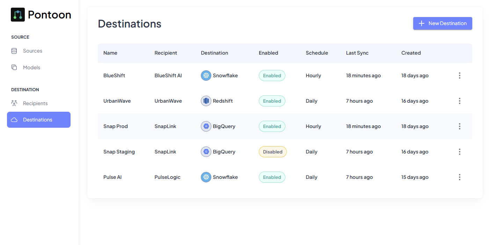
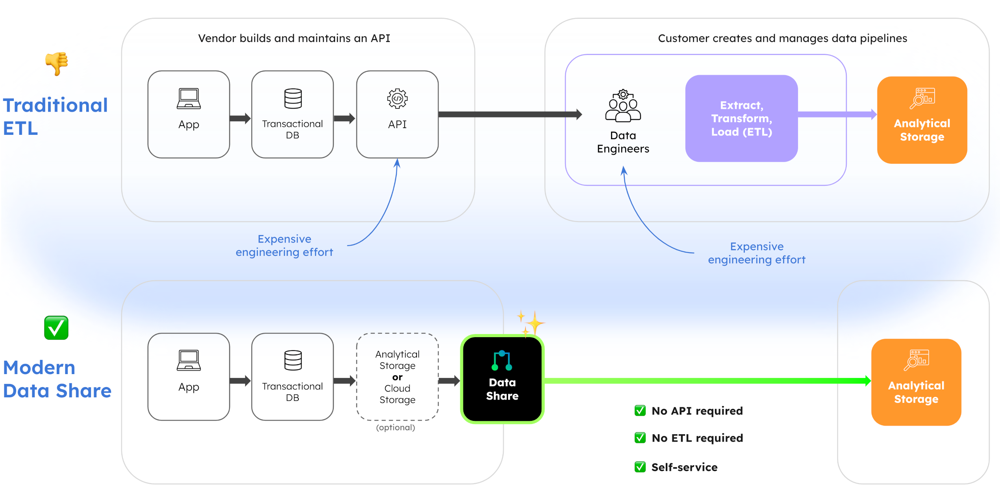

<div align="center">
    
    &nbsp;&nbsp;&nbsp;&nbsp;&nbsp;&nbsp;
    <picture>
        <source media="(prefers-color-scheme: dark)" srcset="assets/logo-type-white.png">
        
    </picture>
</div>

<h3 align="center">Build production ready data syncs that<br/>integrate with your customer's data warehouse.</h3>

<div align="center">
    <div>
        <a href="https://pontoon-data.github.io/Pontoon/"><strong>Docs</strong></a> ·
        <a href="https://pontoon-data.github.io/Pontoon/getting-started/quick-start/"><strong>Quick Start</strong></a> ·
        <a href="https://github.com/pontoon-data/Pontoon/issues"><strong>Report Bug</strong></a> ·
        <a href="https://getpontoon.com/contact"><strong>Contact</strong></a> ·
    </div>
    <br/>
    <p align="center">
        <a href="mailto:hello@getpontoon.com"></a>
        <a href="https://github.com/pontoon-data/Pontoon/blob/master/LICENSE" target="_blank">
            
        </a>
        <a href="https://github.com/pontoon-data/Pontoon/blob/master/LICENSE" target="_blank">
            
        </a>
    </p>
</div>

# About

Pontoon is an open source, self-hosted, data export platform. We built Pontoon from the ground up for the use case of shipping data products to your enterprise customers.

Pontoon is engineered to make it easy to sync data directly to your customer's data warehouse (eg. [Snowflake](https://www.snowflake.com/), [BigQuery](https://cloud.google.com/bigquery), and [Redshift](https://aws.amazon.com/redshift/)). Your customers get their data, without needing to build ETLs or pay for ETL tools, empowering them to make data driven decisions for their business, with data from your product.

Welcome to the future of customer data syncs 🚀

> Want to get Pontoon up and running in minutes? Try our [Quick Start Guide](https://pontoon-data.github.io/Pontoon/getting-started/quick-start/).

<div align="center">
  
</div>

## Key Features

- **🚀 Easy Deployment**: [Get started](https://pontoon-data.github.io/Pontoon/getting-started/quick-start/) in minutes with Docker or deploy to [AWS Fargate](https://pontoon-data.github.io/Pontoon/getting-started/aws-fargate/)
- **🎯 Major Data Warehouses Integrations**: Supports [Snowflake](https://www.snowflake.com/), [Google BigQuery](https://cloud.google.com/bigquery), [Amazon Redshift](https://aws.amazon.com/redshift/), and [Postgres](https://www.postgresql.org/) as sources and destinations
- **☁️ Multi-cloud**: Send data from any cloud to any cloud. Amazon Redshift ➡️ Google BigQuery? No problem!
- **⚡ Automated Syncs**: Schedule data transfers with automatic backfills. Incremental loads automatically keep destination datasets in sync
- **🏗️ Built for Scale**: Sync over 1 million records per minute
- **✨ Web Interface**: User-friendly dashboard for managing syncs, built with React/Nextjs
- **🔌 REST API**: Programmatic access to all Pontoon features, built with FastAPI
- **✅ Open Source**: Complete control over your data and infrastructure with zero lock-in

# The Problem with APIs & Data

### Data Export with APIs

We built Pontoon because traditional APIs are becoming increasingly problematic at modern data scale:

- **Performance Issues**: APIs struggle with large datasets and complex queries
- **Poor Customer Experience**: Customers have to spend weeks building ETLs or pay for managed ETL tools ($$$)
- **Rate Limits**: Data workloads tend to be bursty, often triggering rate limits, resulting in a frustrating experience for everyone involved
- **Backfills**: Backfilling historical data through APIs is inherently slow, as most APIs are optimized for real-time, not bulk ingestion

### Data Export with Pontoon

Pontoon solves these problems with:

- **Direct Warehouse Integration**: Send data directly to customer's data warehouse. No more ETLs needed!
- **Scalable Architecture**: Handle millions of rows efficiently. Say goodbye to rate limits!
- **Automated Scheduled Syncs**: Automatically keep destinations up to date, only syncing data that's changed/new. Backfills are completed on the first sync.
- **Self-Hosted**: Full control over your data and infrastructure

# Is Pontoon Just Another ETL Platform?

Short Answer: **No.**

ETL platforms are used by data teams to **pull data out** of vendors (eg. Salesforce). Data teams maintain/pay for the ETL platform.

Pontoon is used by vendors (eg. Salesforce) to **provide data syncs** as a product feature for their customer's data team. The vendor deploys Pontoon.

<div align="center">
  
</div>

# Pontoon vs. Other ETL / Reverse-ETL Platforms

|                                                | **Pontoon**    | Airbyte | Singer/Stitch        | Fivetran             | Hightouch                 | Prequel | Bobsled |
| ---------------------------------------------- | -------------- | ------- | -------------------- | -------------------- | ------------------------- | ------- | ------- |
| **Open Source**                                | ✅ Yes         | ✅ Yes  | ✅ Singer only       | ❌ No                | ⚠️ Some SDKs              | ❌ No   | ❌ No   |
| **Self-Hosted Option**                         | ✅ Yes         | ✅ Yes  | ✅ Yes               | ❌ No                | ✅ Yes                    | ✅ Yes  | ❌ No   |
| **First-class Data Products**                  | ✅ Yes         | ❌ No   | ❌ No                | ❌ No                | ⚠️ Possible (with effort) | ✅ Yes  | ✅ Yes  |
| **Multi-Tenant Data Export**                   | ✅ Yes         | ❌ No   | ❌ No                | ❌ No                | ⚠️ Custom                 | ✅ Yes  | ✅ Yes  |
| **Direct Data Warehouse Integrations**         | ✅ Yes         | ✅ Yes  | ⚠️ Destinations only | ⚠️ Destinations only | ⚠️ Sources only           | ✅ Yes  | ✅ Yes  |
| **DBT Integration**                            | 🚧 Coming soon | ❌ No   | ❌ No                | ⚠️ Limited           | ✅ Yes                    | ❌ No   | ❌ No   |
| **Bulk Transfers (millions/billions of rows)** | ✅ Yes         | ✅ Yes  | ⚠️ Possible          | ⚠️ Possible          | ❌ No                     | ✅ Yes  | ✅ Yes  |
| **Full Database/Table Replication**            | ❌ No          | ✅ Yes  | ❌ No                | ❌ No                | ❌ No                     | ❌ No   | ❌ No   |
| **Free to Use**                                | ✅ Yes         | ✅ Yes  | ✅ Yes (Singer CLI)  | ❌ No                | ⚠️ Limited                | ❌ No   | ❌ No   |

# Quick Start

Get Pontoon running in seconds with our official docker image. Visit our [docs](https://pontoon-data.github.io/Pontoon/getting-started/quick-start/) for more information.

```sh
docker run \
    --name pontoon \
    -p 3000:3000 \
    -p 8000:8000 \
    --rm \
    --pull=always \
    -v pontoon-internal-postgres:/var/lib/postgresql/data \
    -v pontoon-internal-redis:/data \
    ghcr.io/pontoon-data/pontoon/pontoon-unified:latest
```

> [!NOTE]
> If you're using CMD or Powershell, run the command in one line, without `\`

To view the Web UI: `localhost:3000`. To view the OpenAPI docs / test the API: `localhost:8000/docs`.

Check out the [transfer quick start guide](https://pontoon-data.github.io/Pontoon/getting-started/transfer-quick-start/) to add your first source and destination.

> [!NOTE]
> Pontoon collects anonymous usage data by default to help us improve the product. No sensitive data is collected, but if you'd like to disable this you can do so by setting the `PONTOON_TELEMETRY_DISABLED` environment variable to `true`.

## Running Pontoon with Docker Compose

**Requirements:** [Docker Compose v2](https://docs.docker.com/compose/install/)

To build Pontoon from source, use Docker Compose.

```sh
docker compose up --build
```

## Creating Your First Data Export

To quickly set up your first transfer in Pontoon, follow the steps in the [transfer quick start](https://pontoon-data.github.io/Pontoon/getting-started/transfer-quick-start/) guide!
